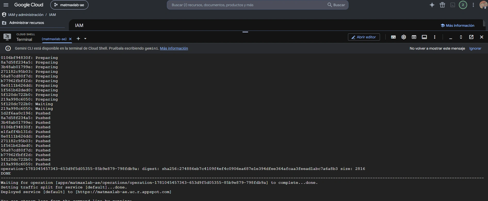

# App Engine First Deploy
Laboratorio Google App Engine: Entorno de ejecución personalizado de nginx para App Engine, con versionado de aplicación y traffic spliting de las mismas.

En este laboratorio se realizó un deploy en App Engine de un container Docker que contiene una página web estática sencilla corriendo sobre un servidor nginx. Luego se realizó otro deploy con una nueva version de Service (con otra página estática diferente) de App Engine y se implementa un Canary con Split traffic en un 50%. Esto logra que todas las peticiones se dividan en un 50% hacia la primera version y el otro 50% hacia la segunda version.

Para este laboratorio se utilizó la imagen oficial de Docker de nginx y la documentación oficial recomendada por Google Cloud Platform.
  * [app.yaml - Archivo yaml para la configuración de App Engine. Esto simplemente declara que el entorno de ejecución es personalizado y que se debe usar el Dockerfile para ejecutar la aplicación.](https://github.com/MatiasMaxRodriguez/App-Engine-First-Deploy/blob/main/app.yaml)
  * [Dockerfile - Define la imagen de Docker. Se basa en la imagen oficial de Docker de nginx y añade los archivos de configuración y estáticos.](https://github.com/MatiasMaxRodriguez/App-Engine-First-Deploy/blob/main/Dockerfile)
  * [nginx.conf - Archivo de configuración básica de nginx.](https://github.com/MatiasMaxRodriguez/App-Engine-First-Deploy/blob/main/nginx.conf)
  * [www/index.html - Página de prueba cargada en nginx.](https://github.com/MatiasMaxRodriguez/App-Engine-First-Deploy/blob/main/www/index.html)

## Vista previa del proyecto

## Tecnologías utilizadas

[Google App Engine](https://docs.cloud.google.com/appengine/docs/an-overview-of-app-engine?hl=es-419)
[Docker](https://www.docker.com/)
[Nginx](https://nginx.org/)
[Yaml](https://yaml.org/)
[HTML](https://html.spec.whatwg.org/multipage/)
